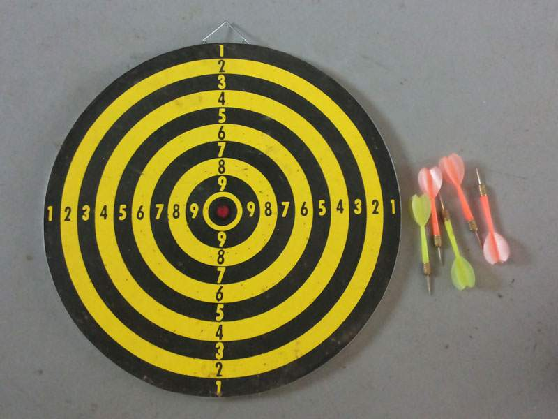

```{r global_options, include=FALSE}
knitr::opts_chunk$set(fig.align = 'center', warning=FALSE, message=FALSE, fig.asp=0.625, dev='png', global.par = TRUE, dev.args=list(pointsize=10), fig.path = 'figs/')
library(MASS)
```
```{r setup, include=FALSE}
library(knitr)
local({
  hook_plot = knit_hooks$get('plot')
  knit_hooks$set(plot = function(x, options) {
    paste0('\n\n----\n\n', hook_plot(x, options))
  })
})
```
# Central Limit Theorem
If $X_1, X_2, \ldots, X_n$  be a sequence of iid random variables of size $n$ from a distribution with mean $\mu$ and finite variancen $\sigma^2$, then, for large n, the sample average 
$$ \bar X \dot \sim N(\mu, \sigma^2/n)$$
where $\dot \sim$ indicates convergence in distribution. The CLT supports the normal approximation to the distribution of a rv that can be viewed as the sum of other r.v.

## Approximation with CLT: application

The approximation above is useful in statistics for computing some quantities. For instance, given $X \sim B_i(n,p)$ and $Y \sim B_i(n, q)$, how can we easily compute the probability $P(X>Y)$? 

Normal approximation is the simplest way to do it. We may approximate: $X \approx {\cal N}(np, np(1-p)), \ Y \approx {\cal N}(nq, nq(1-q))$. 

Then, we may use a well known probability result, that is the difference $W=X-Y$ of two independent normal distribution with means $\mu_X, \mu_Y$ and variances $\sigma^2_X, \sigma^2_Y$ respectively, is *still a normal ditribution* with mean $\mu_X-\mu_Y$ and variance $\sigma^2_X+\sigma^2_Y$.

In this case, $\mu_w=\mu_X-\mu_Y= n(p-q)$ and variance $\sigma^2_w=\sigma^2_X+\sigma^2_Y=n(p(1-p)+q(1-q))$.

## Approximation with CLT: real application with waterpolo goals

Tomorrow two professional Italian waterpolo teams, Posillipo and Pro Recco, compete against each other: $X$ and $Y$ are the random *goals scored* by both the teams. We assume they follow two independent Binomial distributions: precisely, $X, Y$ represent the number of shots converted in goal on the total number of shots $n, m$ made by Pro Recco and Posillipo respectively, with probabilities $p,q$. 

Before a match, the number of shots are *unknown*. In what follows, we adopt a simplification, and we treat the quantities $p,q,m,n$ as *known*, for instance fixing them upon historical experience: $p=0.5, q=0.7, n=20, m=20$.

We want to investigate the Posillipo probability of winning the next match against Pro Recco, $P(X>Y)=P(X-Y>0)$. 


```{r binom_water, echo=TRUE,  results='hold', fig.keep='high', fig.height=8, fig.width=5}
p<-0.5; q<-0.7; n<-20; m<-20
Prob_posillipo <- pnorm(0, mean=p*n-q*m, 
                        sd=sqrt( n*p*(1-p)+m*q*(1-q)  ),  
                        lower.tail=FALSE)
Prob_posillipo
```

Suppose we want make inference for the mean $\mu_{w}=\mu_{X}-\mu_{Y} \approx mq-np$. The $1-\alpha$ confidence interval for $\mu_{w}$ is approximately defined as:

$$  P\left(  \overline{W}_n-\frac{\sigma_{w}}{\sqrt{n}}z_{\alpha/2} \le \mu_{w} \le \overline{W}_n+\frac{\sigma_{w}}{\sqrt{n}}z_{1-\alpha/2}  \right)=1-\alpha $$


```{r binom_water2, echo=TRUE,  results='hold', fig.keep='high', fig.height=8, fig.width=5}
conf_int<-function(alpha,n,p,m,q){
  mean=p*n-q*m; sd=sqrt( n*p*(1-p)+m*q*(1-q));
  return(c(qnorm(alpha/2, mean=mean, sd=sd  ),
           qnorm( 1-alpha/2, mean=mean, sd=sd  ) ))
}

conf_int(0.05, n,p,m,q)
conf_int(0.5, n,p, m,q)
```


```{r binom_water3, echo=TRUE}
par(mar=c(5,4,4,1))
curve(dnorm(x,p*n-q*m, sqrt( n*p*(1-p)+m*q*(1-q)) ),
      xlim=c(-12,20), ylim=c(0,0.3), ylab="f(x)", cex.lab=2)
segments(conf_int(0.05,n,p,m,q)[1],-0.01,
        conf_int(0.05,n,p,m,q)[1],
        dnorm(conf_int(0.05,n,p,m,q)[1],p*n-q*m,
              sqrt( n*p*(1-p)+m*q*(1-q)) ),
        col="black",lty=4, lwd=2)
segments(conf_int(0.05,n,p,m,q)[2],-0.01,
        conf_int(0.05,n,p,m,q)[2],
        dnorm(conf_int(0.05,n,p,m,q)[2],p*n-q*m,
              sqrt( n*p*(1-p)+m*q*(1-q)) ), 
        col="black",lty=4, lwd=2)
segments(0, -0.01, 0, dnorm(0, p*n-q*m,
              sqrt( n*p*(1-p)+m*q*(1-q)) ), lwd=2 )
points(dbinom(0:n, n, p), pch=21, bg=1)
points(dbinom(0:m, m, q), pch=21, bg=2)
text(15, 0.1, "Y", cex=2, col=2)
text(10,0.1, "X", cex=2, col=1)
text(-5, 0.15, "X-Y", cex=2, col=1)
```

## Waterpolo goals: what if we use a Poisson distribution?

Rather than specifying in advance the total number of unknown shots and the converting shots probabilities, i.e. 4 parameters, one coud be tempted to use a more flexible distribution accounting just fot the *scoring intensity*, regardless of the number of shots.

For this purpose, the Poisson distribution seems suitable. We may assume two independent Poisson distributions for the number of goals of the upcoming match: $X\sim \mathcal{P}(\lambda), \ Y \sim \mathcal{P}(\mu)$.

At this stage, in order to make the same prediction as before, we need to specify the rates, for instance upon our own knowledge about waterpolo abilities: $\lambda=5, \mu=7$.

How can we estimate now the winning probability for Posillipo, $P(X>Y)=P(X-Y>0)$?


We may use the following probability result: $X-Y \sim \mathcal{PD}(\lambda-\mu, \lambda+\mu)$, where $\mathcal{PD}$ stands for the **Poisson difference** distribution, also known as **Skellam** distribution, with mean $\lambda-\mu$ and variance $\lambda+\mu$.

```{r skellam_water, echo=TRUE,  results='hold', fig.keep='high', fig.height=8, fig.width=5}
library(skellam)
lambda <- 5; mu <- 7.5
Prob_posillipo_skellam <- pskellam(0, lambda, mu, lower.tail=FALSE)
Prob_posillipo_skellam
```


```{r skellam_water3, echo=TRUE}
par(mar=c(5,4,4,1))
plot(0:20, dpois(0:20, lambda),xlim=c(-12,20), ylim=c(0,0.3), ylab="f(x)",
     xlab="X", pch=21, bg=1, cex.lab=2)
points(0:20, dpois(0:20, mu),pch=21, bg=2)
points(-10:10, dskellam(-10:10, lambda, mu),pch=1, bg=1 )
segments(0, -0.01, 0, dskellam(0, lambda,mu), lwd=2 )
text(5, 0.25, "X", cex=2, col=1)
text(8,0.25, "Y", cex=2, col=2)
text(-3, 0.25, "X-Y", cex=2, col=1)
```


# Monte Carlo simulation

As we have already seen, *simulation* is a well-known technique designed to approximate a process and to retrieve general results by assuming to observe the process several times. We rely on the so called **Monte Carlo** simulation, a wide class of simulation procedures based on sampling iid values from a process ---precisely, from the underlying presumibly true probability distribution of the process--- and computing numerical outputs. In what follows, we will consider the behaviour of some sample statistics, such as the mean and the variance, through their sample distribution. The steps of a Monte Carlo simulation are:

- generate $n$ iid values from a process;

- compute a summary for this sample, a statistic;

- repeat the steps above $R$ times and obtain a sample distribution for the statistic.

## Some relationships among probability distributions

Let $U_i\sim U(0,1)$, $i=1,\ldots,n$ be iid random variables. Usign a suitable r function to simulate pseudo-random numbers, we verify that the rv $X$ defined as:
$$X=-\frac{\log(U_1)}{\lambda}$$ follows an exponential distribution with parameter $\lambda$.

```{r exp1}
R <- 1000
lambda <- 2

u <- c()
v <- vector(mode="numeric",length=R)

for(i in 1:R) {
  u <- runif(1,0,1)
  v[i] <- -log(u)/lambda
}

# for(i in 1:R) {
#   v[i] <- -log(runif(1,0,1))/lambda
# }

hist(v, prob=TRUE, breaks = 30)
curve(dexp(x, lambda), add=T)

u
```

Now we verify that the new rv $Z=min\{X_1,X_2, \ldots, X_n\}$, where $X_i=-\log(U_i)/\lambda$, follows an exponential distribution with parameter $\sum_i^n\lambda_i$ (that here is $n\lambda$).
```{r exp2}
# distribution of min(x1, ..xn) with xi=exp(lambda) 
z <- vector(mode="numeric", length=R)
n <- 10
for (i in 1:R) {
  u <- runif(n,0,1)
  z[i] <- min(-log(u)/lambda)
}
# min of n exp. variables is exp(n*lambda)
hist(z,prob=TRUE,breaks=30,main="")
curve(dexp(x, n*lambda), add=T, col=4, lwd=2)

u
```

**It's your turn** Verify that the distribution of the rv $Y=\sum_i^nX_i$ follows a Gamma distribution with parameters shape=$n$ and rate=$\lambda$. Compare the exact distribution with the approximated one derived from the CLT.
```{r exp3}
n <- 10
x <- vector(mode="numeric", length=R)
for (i in 1:R) {
  u <- runif(n,0,1)
  x[i] <- sum(-log(u)/lambda)
}

# sum of exp. variables is gamma
hist(x,prob=TRUE,breaks=30,main="")
curve(dgamma(x, shape=n, rate=lambda), add=T, col=4, lwd=2)

# increase n
n <- 200
for (i in 1:R) {
  u <- runif(n,0,1)
  x[i] <- sum(-log(u)/lambda)
}
hist(x,prob=TRUE,breaks=30,main="")
curve(dgamma(x, shape=n, rate=lambda), add=T, col=4, lwd=2)
curve(dnorm(x, mean=n/lambda, sd=sqrt(n/lambda^2)), add=T, col=3, lwd=2)
```

## Normal and chi-square distribution
Let $x_1, x_2, \ldots, x_n$ a random sample simulated from $X\sim N(0,1)$ and $T_n=\sum_i^nX_i^2$. Using a Monte Carlo simulation study, verify that $T_n$ follows a chi-square distribution with n degrees of freedom.
```{r}
n <- 10
nsim <- 10000
chisq.mc <- 0
for (i in 1:nsim){
  x <- rnorm(n = n, mean = 0, sd = 1)
     chisq.mc[i] <- sum(x^2)
 }

hist(x = chisq.mc, probability = TRUE, xlab="x", breaks = 30)
curve(expr = dchisq(x = x, df = n), add = TRUE, col = 2)
chisq.ECDF <- ecdf(chisq.mc)
curve(expr = chisq.ECDF(x), from = 0, to = 25, xlab = "x")
curve(expr = pchisq(q = x, df = n ), add = TRUE, col = 2)
```

**It's your turn** Following the setup of the point above ($T_n\sim \chi^2_n$, with $n=10$), write a function to compare the sample mean, sample variance and sample quantiles (0.01, 0.05), with the theoretical ones. The function should take in input the number of MC simulations and return a table with four rows and 2 columns (sample and theretical results).
```{r}
compare <- function(nsim){
   chisq.mc <- 0
   for (i in 1:nsim){
     x <- rnorm(n = 10, mean = 0, sd = 1)
     chisq.mc[i] <- sum(x^2)
     }
    chisq.mc.mean <- mean(chisq.mc)
    chisq.mc.var <- var(chisq.mc)
    chisq.mc.quant <- quantile(x = chisq.mc, probs = c(0.01,0.05))

    chisq.mc.results <- c(chisq.mc.mean, chisq.mc.var, chisq.mc.quant)
    chisq.truevalues <- c(n, 2*n, qchisq(p = c(0.01,0.05), df = 10))
    compare <- data.frame(chisq.mc.results, chisq.truevalues)
return(compare)
}

compare(100)
compare(500)
compare(1000)
```


## Distribution of the sample mean

Suppose three different cases: 

- $y_1, \ldots, y_n \sim \mathcal{N}(0,1)$;

- $y_1, \ldots, y_n \sim t_{3}$;

- $y_1, \ldots, y_n \sim \mbox{Unif}(0,1)$.

Which is the distribution of the sample mean $\overline{Y}=\frac{1}{n}\sum_{i=1}^{n}y_{i}$? Before answering, let's investigate this issue via simulation, with $R=1000$ and $n=30$.


```{r mc, echo=TRUE}
set.seed(1234)
R <- 1000
n <- 30

#generate n values R times
samples <- array(0, c(3,R,n))
  for (i in 1:R){
    samples[1, i, ] <- rnorm(n, 0, 1)
    samples[2, i, ] <- rt(n, df = 3)
    samples[3, i, ] <- runif(n, 0, 1)
  }

#compute the sample statistics
samples_stat <- array(0, c(3, 2, R))
  for (j in 1:3){
  #sample mean over R replications 
    samples_stat[j, 1, ] <- apply(samples[j, , ], 1 , mean , na.rm=TRUE)
  #sample variance over R replications
    samples_stat[j, 2, ] <- apply(samples[j, , ], 1 , var )
  }
  
#visualize the results
par (mfrow=c(1,3), oma=c(0,0,0,0))
hist(samples_stat[1, 1, ], breaks= 30, probability = TRUE, 
xlab="y", main= "N(0,1)", cex.main=1.5)
#overlap the true distribution for the sample mean
curve(dnorm(x, 0, sqrt(1/n)), add = TRUE, col = "red", lwd = 2)

hist(samples_stat[2, 1, ], breaks= 30, probability = TRUE, 
xlab="y", main= expression(t[3]), cex.main =1.5)
#overlap the asymptotic distribution for the sample mean
  curve(dnorm(x, 0, sqrt(  (3/((3-2)*n)))), add = TRUE, col = "red", lwd = 2)

hist(samples_stat[3, 1, ], breaks= 30, probability = TRUE, 
xlab="y", main=  "U(0,1)", cex.main = 1.5)
#overlap the asymptotic distribution for the sample mean
curve(dnorm(x, 1/2, sqrt(1/(12*n))), add = TRUE, col = "red", lwd = 2)
```

As we already know from the theory, in the Gaussian case the **sample mean** $\overline Y$ for iid values still follows a normal distribution, precisely $\mathcal{N}(\mu, {\sigma^{2}}/{n})$. For other distributions---see the plots above---this result is true only asymptotically, when $n \rightarrow \infty$, due to the CLT theorem. When the sampling does not come from a Normal distribution, we will use the short notation $\overline{Y} \overset{\cdot}{\sim} \mathcal{N}(\mu, {\sigma^{2}}/{n})$.


## Distribution of the sample variance

We know that $s^{2}= \frac{1}{n-1} \sum_{i=1}^{n}(y_{i}-\bar{y})^{2}$ is an unbiased estimator for the variance, and this is exatcly the output provided by $\mathsf{R}$ through the function $\mathsf{var()}$ applied to a sample vector. In the example above, we have already stored the variance. If the assumed true model is normal, we know that the distribution of the sample variance is proportional to a $\chi^{2}$  distribution with $n-1$ degrees of freedom:

$$ s^2 \sim \frac{\sigma^{2}}{n-1} \chi^{2}_{n-1}$$


```{r mc_2, echo=TRUE}
#visualize the results: variance
sigma <- 1
par (mfrow=c(1,3), oma=c(0,0,0,0))
hist(samples_stat[1, 2, ], breaks= 30, probability = TRUE, 
xlab=expression(s^2), main="N(0,1)", cex.main=1.5)
curve(((n-1)/sigma^2) * dchisq(x * ((n-1)/sigma^2), df = n - 1),
add = TRUE, col="red", lwd=2)

sigma <- sqrt(3/(3-2))
hist(samples_stat[2, 2, ], breaks= 40, probability = TRUE,
xlab=expression(s^2), main="t(3)", cex.main =1.5, xlim=c(0,25))
curve(((n-1)/sigma^2) * dchisq(x * ((n-1)/sigma^2), df = n - 1),
add = TRUE, col="red", lwd=2)

curve(( (2*sigma^4/var(samples_stat[2, 2, ]))/sigma^2)*dchisq(x *( 2*sigma^4/var(samples_stat[2, 2, ])/(sigma^2)), df = 2*sigma^4/var(samples_stat[2, 2, ])),
add = TRUE, col="green", lwd=2)

sigma <- sqrt(1/12)
hist(samples_stat[3, 2, ], breaks= 30, probability = TRUE,
xlab="x", main=  "U(0,1)", cex.main = 1.5)
curve(((n-1)/sigma^2) * dchisq(x * ((n-1)/sigma^2), df = n - 1),
add = TRUE, col="red", lwd=2)
curve(( (2*sigma^4/var(samples_stat[3, 2, ]))/sigma^2)*dchisq(x *( 2*sigma^4/var(samples_stat[3, 2, ])/(sigma^2)), df = 2*sigma^4/var(samples_stat[3, 2, ])),
add = TRUE, col="green", lwd=2)

```
_Ref_: https://www.tandfonline.com/doi/abs/10.1080/00031305.2014.966589

We could also rely on the biased estimator $s^{2}_{b}= \frac{1}{n}\sum_{i=1}^{n}(y_{i}-\bar{y})^{2}$. 
Recall that: An estimator is said to be **unbiased** iff $$E(\widehat{{\theta}})= {\theta}.$$

**It's your turn**

Check the biased nature of $s^{2}_b$ via MC simulation, generating $n = 10$ iid values from a normal distribution. Plot also $s^2$ and comment the difference.

```{r mc_3, echo=FALSE}
set.seed(2)
R <- 1000
n <- 10
mu <- 5
sigma <- 2
y <- matrix (NA, R, n)
s_squared <- c()
s_squared_biased <- c()

for ( i in 1 :R){
  y[i, ] <- rnorm(n, mu, sigma)
  s_squared[i] <- (1/(n-1))*sum((y[i, ]-mean(y[i, ]))^2) 
  s_squared_biased[i] <- (1/(n))*sum((y[i, ]-mean(y[i, ]))^2)
    }
s_squared_mean <- mean(s_squared)
s_squared_biased_mean <- mean(s_squared_biased)

#plot s2
par(mfrow=c(1,2), oma=c(0,0,0,0))
hist(s_squared, breaks=50, xlab=expression(s^2), probability=TRUE,
  main=expression(s^2),
  cex.main = 1.5)
#in red the true mean, in blue the estimated mean
abline(v=sigma^2, col="red", lwd=2)
abline(v=s_squared_mean, col="blue", lwd=2, lty=2)
#plot s2 biased
hist(s_squared_biased, breaks=50, xlab=expression(s[b]^2), probability=TRUE,
  main=expression(s[b]^2),
  cex.main = 1.5)
#in red the true mean, in blue the estimated mean
abline(v=sigma^2, col="red", lwd=2)
abline(v=s_squared_biased_mean, col="blue", lwd=2, lty=2)

```


# Basic concepts of estimation

## Point estimation

We will denote with $\hat{{\theta}}$ the point estimator for the parameter ${\theta}$. An estimator is said to be **unbiased** iff $$E(\widehat{{\theta}})= {\theta}.$$

An estimator is said to be **consistent** if $$ \widehat \theta \overset{P}{\rightarrow} \theta, \ \text{as } n \rightarrow \infty,$$ or, equivalently, if $\text{var}(\widehat \theta) \rightarrow 0, \ \text{as } n \rightarrow \infty$.

There are some properties we would ensure for an estimator: **low variance** and **low bias**. But, there is *tradeoff* between unbiasedness and low variance, so we usually seek to get both (to some extent); ideally we would target a small
**Mean Squared Error (MSE)**:
$$
{\rm MSE}(\widehat\theta) = E\{(\widehat\theta-\theta)^2 \} = \{ E(\widehat\theta)-\theta  \}^2 + \text{var}(\widehat\theta)=\text{Squared bias}
 +\text{Variance} \, .
$$ 


As we already know from the theory, the sample mean is an excellent estimator for the population mean. But we will consider now other estimators. Consider the well-known case of a normal distribution $\mathcal{N}(\mu, \sigma^{2})$, and the following estimators:

- sample mean: $\widehat \mu_{1}= \bar{y}$;

- median: $\widehat \mu_{2}=\text{Me}(y)$;

- the semi-sum of the maximum and the minimum:  $\widehat \mu_{3}=\frac{1}{2}(\max{y}+\min{y})$;

- the trimmed mean $\widehat \mu_{4}= \frac{1}{n-2}\sum_{i=2}^{n-1}y_{i}$;

```{r point_1, echo=TRUE}
set.seed(4)
# number of replications
R <- 1000
#number of samples for each replication
n <- 10
mu <- 5
sigma <- 2

estimator_1 <- c()
estimator_2 <- c()
estimator_3 <- c()
estimator_4 <- c()
y <- matrix(NA, R,n)
  
  for (i in 1:R){
    y[i, ] <- rnorm(n, mu, sigma)
    estimator_1[i] <- mean(y[i, ])
    estimator_2[i] <- median(y[i, ])
    estimator_3[i] <- (max(y[i, ])+min(y[i, ]))/2
    estimator_4[i] <- sum(y[i, -c(1,n)])/(n-2)
  }

par(mfrow=c(1,1), xaxt="n")
boxplot(cbind(estimator_1, estimator_2, estimator_3, estimator_4), main="Comparison between four estimators")
par(xaxt="s")
axis(1, 1:4, c(expression(hat(mu)[1]), expression(hat(mu)[2]), expression(hat(mu)[3]), expression(hat(mu)[4])) )
abline(h=5, lwd=2, col="blue")


```


Now we should compare the estimators above in terms of unbiasedness, efficiency, consistency and robustness. All the four estimators appear unbiased. But what about their efficiency? 


```{r point_2, echo=TRUE}

estimators <- cbind(estimator_1, estimator_2, estimator_3, estimator_4)
variances <- c()

  for (g in 1:4){
    variances[g] <- var (estimators[,g])
  }

variances
```

The sample mean registers the lowest variance, which is a good approximation for $\sigma^{2}/n= 4/10 =0.4$. 

**It's your turn** Let's check now whether all the estimators are consistent. For checking this statement, $n=10$ is extremely low and we need to increse it, let's say $n=200$. Compare, using histograms, the simulated values for $n=10$ with those obtained for $n=200$. What do you expect?

```{r point_3, echo=TRUE}

#normal case

estimators_cons <- matrix(NA, R, 4)
n <- 200

  
  for (i in 1:R){
    y <- rnorm(n, mu, sigma)
    estimators_cons[i , 1] <- mean(y)
    estimators_cons[i , 2] <- median(y)
    estimators_cons[i , 3] <- (max(y)+min(y))/2
    estimators_cons[i , 4] <- sum(y[ -c(1,n)])/(n-2)
  }


# n =10
par(mfrow=c(2,4))
  for (g in 1:4){
    hist(estimators[,g],  probability = TRUE, 
      breaks=40, main=substitute(hat(mu)[g] ,list(g = g)),
      xlab="", xlim=c(0,10), cex.main = 1.5)
      abline(v=mu, col="blue", lwd=2)
  }

# n= 200

  for (g in 1:4){
    hist(estimators_cons[,g],  probability = TRUE, 
      breaks=40, main=substitute(hat(mu)[g] ,list(g = g)), 
      xlab="", xlim=c(0,10), cex.main = 1.5)
      abline(v=mu, col="blue", lwd=2)
  }
```


## Interval estimation

Giving a point value is in most cases a rude estimate. Rather, we may construct an interval for our parameter, giving an entire set of values to estimate the model
parameter. Interval estimation is based upon **pivotal quantities**; in the normal case with $\sigma^{2}$ *known*, the pivotal quantity for $\mu$ is defined as:

$$
T(\mu) = \dfrac{\overline{Y}-\mu}{{\dfrac{\sigma}{\sqrt{n}}}} \sim \mathcal{N}(0,1) \, , \hspace{1cm}
\forall \mu \in \mathbb{R}\, , \sigma^2>0.
$$
Then, it follows that for $0<\alpha<1$

$$ Pr (-z_{1-\alpha/2} \le T(\mu) \le z_{1-\alpha/2} )= 1-\alpha, $$

and a confidence interval of level $1-\alpha$ for $\mu$ is given by: $$ \left(\bar{y}-z_{1-\alpha/2}\frac{\sigma}{\sqrt{n}},\ \bar{y}+z_{1-\alpha/2}\frac{\sigma}{\sqrt{n}} \right),$$  
where $-z_{1-\alpha/2}, z_{1-\alpha/2}$ represent the $\alpha/2$ and the $1-\alpha/2$ quantiles of the standard normal distribution respectively. Also for interval estimation, MC simulation is well suited for exploring the procedure:


```{r int_1, echo=TRUE}
#normal case
set.seed(10)

R <- 100
n <- 10

plot(0,0,xlim=c(0,10),ylim=c(0,11), type="n", xlab=expression(mu), ylab="",
main = paste("100 IC for the mean (known variance)"), cex.main=1.2)
abline(v=mu)
alpha <- 0.05
inf <- vector(mode="numeric", length=R)
sup <- vector(mode="numeric", length=R)
l <- vector(mode="numeric",   length=R)
d <- 0
  for (i in 1:R)
  {
    y <- rnorm(n, mu, sigma)
    inf[i] <- mean(y)-qnorm(1-alpha/2)*sigma/sqrt(n)
    sup[i] <- mean(y)+qnorm(1-alpha/2)*sigma/sqrt(n)
    d <- d + 0.1 
    l[i] <- (mu > inf[i] & mu < sup[i]) 
    lines(seq(inf[i],sup[i],length=100), rep(d, 100), col=(l[i]+1))
  }

# compute the coverage
sum(l)

```


For the mean of a normal distribution when $\sigma^{2}$ is *unknown*, we have the following result:

$$
T(\mu) = \dfrac{\overline{Y}-\mu}{{\dfrac{s}{\sqrt{n}}}} \sim t_{n-1} \, , \hspace{1cm}
\forall \mu \in \mathbb{R}\, , \sigma^2>0
$$

```{r int_2, include=TRUE}
plot(0,0,xlim=c(0,10),ylim=c(0,11), type="n", xlab=expression(mu), ylab="",
main = paste("100 IC for the mean (unknown variance)"), cex.main=1.2)
abline(v=mu)
alpha <- 0.05
inf <- vector(mode="numeric", length=R)
sup <- vector(mode="numeric", length=R)
l <- vector(mode="numeric",   length=R)
d <- 0
  for (i in 1:R)
  {
    y <- rnorm(n, mu, sigma)
    s <- sd(y)
    inf[i] <- mean(y)-qt(1-alpha/2, n-1)*s/sqrt(n)
    sup[i] <- mean(y)+qt(1-alpha/2, n-1)*s/sqrt(n)
    d <- d + 0.1 
    l[i] <- (mu > inf[i] & mu < sup[i]) 
    lines(seq(inf[i],sup[i],length=100), rep(d, 100), col=(l[i]+1))
  }

# compute the coverage
sum(l)

```


Let's take an example with real data. The dataset $\mathsf{pair65}$ in the $\mathsf{DAAG}$ package contains the differences in mm between the members of nine pairs of elastic bands. One member of each pair was placed in hot water for four minutes, while the other was left at ambient temperature. After ten minutes, the differences were recorded:


```{r int_3, include=TRUE}
library(kableExtra)
library(DAAG)
options(knitr.table.format = "html") 
pair_data_frame <- cbind(pair65, pair65[,1]-pair65[,2])
pair_data_frame <- cbind(c(1:9), pair_data_frame)
dimnames(pair_data_frame)<- list(1:9, c("pair","heated", "ambient", "difference"))

kable(pair_data_frame, "html") %>%
  kable_styling(bootstrap_options = "striped", full_width = F)

```

We have two independent samples, heated and ambient, of size $n_{1}$ and $n_2$ respectively, with $n_1=n_2=9$. We are interested in assessing the sample mean difference $$\overline d=\overline y_{1}-\overline y_{2} = 6.33.$$ $s=6.10$, and $s/\sqrt{n}=2.03$. The pivotal quantity is then:

$$ T(\mu)= \frac{\overline d -\mu}{s / \sqrt{n}}= \frac{\overline d-\mu}{s / \sqrt{9}}=\frac{6.33-\mu}{2.03}  \sim t_{8}. $$

We may compute some confidence intervals at $95\%$ or $99\%$.

```{r int_4, include=TRUE}

#compute quantiles for student t with n-1 =8 degrees of freedom
 alpha <- 0.05
q_inf_95 <- qt(alpha/2, df=8)
q_sup_95 <- qt(1-alpha/2, df=8)

alpha <- 0.01
q_inf_99 <- qt(alpha/2, df=8)
q_sup_99 <- qt(1-alpha/2, df=8)


#compute the confidence intervals

library(RColorBrewer)
plotclr <- brewer.pal(6,"YlOrRd")
d <- mean(pair_data_frame[,4])
s <- sd(pair_data_frame[,4] )
n <- length(pair_data_frame[,4])

conf_int_95 <- c(d-q_sup_95*s/sqrt(n),d-q_sup_95*s/sqrt(n))
conf_int_99 <- c(d-q_sup_99*s/sqrt(n),d-q_sup_99*s/sqrt(n))

par(mfrow=c(1,2), oma=c(0,0,0,0))

# 95% confidence interval

curve(dt(x,8),xlim=c(-6,6), ylim=c(0,0.4),
  main="", col = "blue", lwd = 2, xlab="y", ylab=expression(t[8]),  yaxs="i")
cord.x <- c(q_inf_95,seq(q_inf_95,q_sup_95,0.01),q_sup_95)
cord.y <- c(0,dt(seq(q_inf_95,q_sup_95,0.01),8),0)
polygon(cord.x,cord.y,col=plotclr[3], border = NA )
curve(dt(x,8),xlim=c(-6,6),main=expression(t[8]), col = "blue", lwd = 2, add = TRUE, yaxs="i")

# 99% confidence interval

curve(dt(x,8),xlim=c(-6,6), ylim=c(0,0.4),
  main="", col = "blue", lwd = 2, xlab="y",  ylab=expression(t[8]),  yaxs="i")
cord.x2 <- c(q_inf_99,seq(q_inf_99,q_sup_99,0.01),q_sup_99)
cord.y2 <- c(0,dt(seq(q_inf_99,q_sup_99,0.01),8),0)
polygon(cord.x2,cord.y2,col=plotclr[5], border = NA )
curve(dt(x,8),xlim=c(-6,6),main=expression(t[8]), col = "blue", lwd = 2, add = TRUE, yaxs="i")

```


# Basic concepts of hypothesis testing


The null hypothesis for the parameter $\theta$ is usually expressed as $$H_{0}: \theta=\theta_0.$$

Complementary to the choice of $H_0$, it is required to select an alternative hypothesis $H_1$, specifying the values of the
parameter which become reasonable when $H_0$ does not hold. Usually $H_1$ may be:

- $H_1: \theta > \theta_0$ or $H_1: \theta < \theta_0$  (**one-sided alternative**);

- $H_1: \theta \ne \theta_0$ (**two-sided alternative**).


## Test for the mean difference

Consider now the number of the 15 most followed accounts on Instagram, expressed in millions, with each total rounded to the nearest million followers, as of March 31, 2018 (Source: *Wikipedia*). Among them, there are 6 musicians and 9 non musicians (called others).


```{r testing_4, echo=TRUE}

Musicians <- c( "Selena Gomez",  "Ariana Grande", "Beyonce" , "Taylor Swift",  "Justin Bieber", "Nicki Minaj")
Others <- c("Cristiano Ronaldo", "Kim Kardashian",  "Kylie Jenner", "Dwayne Johnson", "Neymar", "Lionel Messi", 
  "Kendall Jenner", "Kourtney Kardashian", "Kevin Hart")

n1 <- length(Musicians)
n2 <- length(Others)

Followers_M<- c(135, 118, 113, 107,  98,  86 )
Followers_O <- c(123, 110, 106, 103,  91,  89,  89,  62,  58)
```


```{r testing_hyde, echo=FALSE}
data_instagram_others <- cbind(Others, Followers_O)
data_instagram_musicians <- cbind(Musicians,  Followers_M)

data_instagram_others <- as.data.frame(data_instagram_others)
data_instagram_musicians <- as.data.frame(data_instagram_musicians)

kable(data_instagram_musicians, "html") %>%
  kable_styling(bootstrap_options = "striped", full_width = F, position= "float_left")
kable(data_instagram_others, "html") %>%
  kable_styling(bootstrap_options = "striped", full_width = F, position= "center")


```


We could set up a test with the following aim: do the musicians, on average, have the *same number* of followers than the non-musicians (null hypothesis)? Or, do the musicians have *more* followers? (alternative hypothesis).  If we suppose that $X_{i} \sim \mathcal{N}(\mu_{m}, \sigma^{2}_{m}), i=1,\ldots,n_1$ and $Y_{j} \sim \mathcal{N}(\mu_{o}, \sigma^{2}_{o}), j=1,\ldots,n_2$ are **independent normal samples**, where $n_1$ and $n_2$ denote the number of musicians and others, respectively, we aim at comparing their means, $\mu_{m}$ and $\mu_{o}$ through the following one-sided **two-sample test**:

$$
\begin{cases}
H_0: \mu_{m}-\mu_{o}  = 0  \\
H_1: \mu_{m}-\mu_{o}  > 0  \\
\end{cases}
$$


Let $\overline X$ denote the sample mean for the musicians and $\overline Y$ the sample mean for the others. After a preliminary $F$-test about the variances of the two groups, we may assume that $\sigma^{2}_{m}=\sigma^{2}_{o}$, and then the test statistic for the test above has the form:

$$ T= \frac{\overline X- \overline Y}{s \sqrt{ \frac{1}{n_1}+\frac{1}{n_2}}} \underset{H_{0}}{\sim}t_{n_1+n_2-2},$$
where $n_1+n_2-2= 6+9-2=13$.

```{r testing_5, include=TRUE}

t <- t.test(Followers_M, Followers_O, mu = 0, alternative ="greater", var.equal =TRUE) 
t

## by hand
mx <- mean(Followers_M)
my <- mean(Followers_O)
v <- (var(Followers_M)*(n1-1)+var(Followers_O)*(n2-1))/(n1+n2-2) #pooled variance

test.stat <- (mx-my)/(sqrt(v*(1/n1+1/n2)))
test.stat

pt(test.stat,13, lower.tail = FALSE)
```

The $p$-value is 0.06204, slightly greater than $\alpha$, when $\alpha=0.05$.

```{r testing_6, include=TRUE}

curve(dt(x,13),xlim=c(-5,5), ylim=c(0,0.4),
  main="p-values and rejection region", col = "blue", lwd = 2, xlab="x-y",  ylab=expression(t[13]),  yaxs="i")
cord.x <- c(qt(0.95,13),seq(qt(0.95,13), 5, 0.01), 5)
cord.y <- c(0,dt(seq(qt(0.95,13), 5, 0.01),13),0)
polygon(cord.x,cord.y,col=plotclr[3], border = NA )
curve(dt(x,13),xlim=c(-5,5),main=expression(t[13]), col = "blue", lwd = 2, add = TRUE, yaxs="i")
abline(v =t$statistic, lty=2, lwd=2, col="red")
text (0,0.2, paste("Accept", expression(H0)))
text (2.7,0.08, paste("Reject", expression(H0)))
text(as.double(t$statistic)-0.15, 0.02, "t", col="red", cex=1.2)
```

## Pearson's chi-squared test

This is a class of statistical tests applied to sets of categorical data to evaluate whether any observed difference between the sets arose by chance. It is suitable for unpaired data from large samples. Pearson's chi-squared test is used to assess three types of comparison: **goodness of fit** (establishes whether an observed frequency distribution differs from a theoretical distribution), **homogeneity** (tests if two or more sub-groups of a population share the same distribution of a single categorical variable), and **independence** (determines whether two categorical variables are associated with one another in the population).

- **Goodness of fit: Darts challenge against one friend**

Suppose that $n$ observations $y_{1},\ldots,y_{n}$ are divided among $K$ cells. The following test statistic is then defined:

$$X^{2}= \sum_{k=1}^{K}\frac{ (O_{k}-E_{k})^{2}}{E_{k}} \underset{H_{0}}{\sim}  \chi^{2}_{K-1},$$


where $O_{k}$ are the observed frequencies for cell $k$, $E_{k}$ the expected frequencies for cell $k$ under $H_{0}$. But what is $H_{0}$ here?

For illustration pruposes, suppose you are playing darts against another friend. 

 


You suspect that your friend is not a great darts players, and that his shots along the game will hit the lowest points with great probability and the highest point with low probability. Translated in probability terms, you divide the darts target into $K=4$ zones and you assign  the following hitting probabilities:

-*Zone 1* (from 1 to 3 points): $p_{1}= 7/16$;

-*Zone 2* (from 4 to 6 points); $p_{2}=5/16$;

-*Zone 3* (from 7 to 9 points); $p_{3}= 3/16$;

-*Zone 4* (the highest points in the middle of the target, say 10, 25, 50 points): $p_{4}= 1/16$;

Your null hypothesis is that, *due to a moderate control on his darts skills*, he has decreasing probabilities to hit the best zones:

$$ H_{0}: p_{1}= 7/16;\ p_{2}=5/16;\  p_{3}= 3/16;\ p_{4}= 1/16. $$

Any significative deviation from the above probability distribution, would cause the rejection of your null hypothesis.
For checking your assumption, you count the first $n=50$ attempts $y_{1},\ldots,y_{50}$ of your opponent, and you will code $y_{i}=k$, if the $i$-th shot hits the $k$-th zone.  


```{r testing_7, include=TRUE}
set.seed(101)
n <- 50
K <- 4
# generate the values
y <- sample( 1:K, n, replace=TRUE, prob =c( 7/16, 5/16, 3/16, 1/16))
observed <- table(y)
expected <- c( n*(7/16), n*(5/16), n*(3/16), n*(1/16))
x2 <- sum( (observed-expected)^(2)/expected)
#manually compute the p-value
pchisq(x2, df =K-1, lower.tail =FALSE )
#same result with the chisq.test function
chisq.test( observed, p = c( 7/16, 5/16, 3/16, 1/16)   )


```

Yes, your assumption may be accepted, your friend is hitting the target according to your probabilities... but he wants to play again, and performing another challenge. Before starting, he requires to drink an energetic drink. You are ready to count his next 50 attempts. Does the drink improve the performance?


```{r testing_8, include=TRUE}
y2 <- sample( 1:K, n, replace=TRUE, prob=c(5/16, 3/16, 6/16, 2/16))
new_observed <- table(y2)
#new test after the energetic drink
chisq.test( new_observed, p = c( 7/16, 5/16, 3/16, 1/16)  )
```


Your friend improved his performance! His new shots do not follow your assumed ditribution. Apparently, the energetic drink was strongly required.


```{r testing_9, include=TRUE}
table(y)
table(y2)
```

- **Homogeneity: Darts with more friends**

Suppose now that other five friends join you and the other guy, for a total of $M=6$ friends. Do all of your friends share the same probabilities, with the above probabilites to hit the four zones? We have now this test statistic:


$$ X^{2}= \sum_{k=1}^{K} \sum_{m=1}^{M} \frac{(O_{k,m}-E_{k,m})^2}{E_{k,m}} \underset{H_{0}}{\sim}  \chi^{2}_{(K-1)(M-1)}$$
For each of them, you count the first 50 shots:

```{r testing_10, include=TRUE}
n <- 50
K <- 4
M <- 6
y <- matrix(0, M, n )
# generate the values
for (m in 1:M){
  y[m, ] <- sample(1:K, n, replace=TRUE, prob = c( 7/16, 5/16, 3/16, 1/16) )
} 
observed_matrix <- apply( y,1, table)
chisq.test(observed_matrix, p = c( 7/16, 5/16, 3/16, 1/16) )
```

Yes, the test is suggesting that all of your friends homogenously hit the darts target.

**It's your turn**

What happens if a great player decides to join you, now? Try to simulate the data and perform the test again.
```{r, eval=FALSE, echo=FALSE}

```

**Extra exercise**
  
Sometimes it could be useful to assess the degree of association, or correlation, between paired samples, using the Pearson, the Kendall's $\tau$ or the Spearman's $\rho$ correlation coefficient. Regardless of the adopted cofficient, the null hypothesis for a given correlation coefficent $\rho$ is:
  
$$H_{0}: \rho=0.$$
    
The test statistic is then defined as
  
$$ T= r\sqrt{\frac{n-2}{1-r^{2}}} \underset{H_{0}}{\sim}  t_{n-2},$$
    
    
where $r=Corr(X,Y)$ is the Pearson correlation coefficient. Suppose to have two samples of the same length $x_{1},\ldots,x_{n}, y_{1}, \ldots, y_{n}$, and to measure the association between them. Once we compute the test statistic $t_{obs}$, we may then compute the $p$-value (here we are evaluating a two sided test) as:
      
$$p = 2Pr_{H_{0}}( T \ge |t_{obs}| ).$$
        
        
Consider now some of the most followed Instagram accounts in 2018: for each of the owners, we report also the number of Twitter followers (in milions). Are the Instagram and Twitter account somehow associated? Perform a correlation test, compute the $p$-value and give an answer. Here is the dataframe.
      
```{r testing_11, include=TRUE}
      Owners <- c( "Katy Perry", "Justin Bieber", "Taylor Swift", "Cristiano Ronaldo",
                   "Kim Kardashian", "Ariana Grande", "Selena Gomez", "Demi Lovato")
      Instagram <- c( 69, 98,107, 123, 110, 118, 135, 67)
      Twitter <- c( 109, 106, 86, 72, 59, 57, 56, 56)
      plot( Instagram, Twitter, pch=21, bg=2, xlim=c(60, 150), ylim=c(40, 120) )
      text( Instagram[-6], Twitter[-6]+5, Owners[-6], cex=0.8 )
      text( Instagram[6], Twitter[6]-5, Owners[6], cex=0.8 )
```
      
```{r testing_hyde2, echo=FALSE}
      data <- cbind(Owners, Instagram, Twitter)
      
      kable(data, "html") %>%
        kable_styling(bootstrap_options = "striped", full_width = F)
```
      
      
```{r testing_12, echo=TRUE, eval =TRUE}

```


# Extra: Independent trials: weak law of large numbers

Consider the Bernoulli trials $X_{1}, \ldots, X_{n}$, with mean $p$ and variance $p(1-p)$. For this setting, the **weak law of large numbers** holds:

$$ \overline{X}_n \overset{P}{\rightarrow} p, \ \mbox{as } n \rightarrow \infty, $$
where the notation $\overset{P}{\rightarrow}$ means convergence in probability.

```{r binom_law2, echo=TRUE,  results='hold', fig.keep='high', fig.height=8, fig.width=5}
par(mar = c(4, 4, 0.5, 0.5),mfrow=c(1,1))
#I write the function depending on two arguments: n and p
law_large_numb <- function(n,p){
  x<-rbinom(n, 1,p)
  return(mean(x))
}
law_large_numb <- Vectorize(law_large_numb)
```


```{r binom_law3, echo=TRUE,  results='hold', fig.keep='high', fig.height=4, fig.width=4}
set.seed(12345) 
par(mar = c(6.2, 4, 0, 0.5),mfrow=c(1,1))
curve(law_large_numb(x, p=0.5), 1,1000, xlab="n", 
      ylab="frequency")
abline(a=0.5, b=0, lwd=2, col="red")
legend(80, 0.9, lty=1, col=c("black", "red"), 
       lwd=c(1,2), c( "X/n", "p"))
```

A few trials are needed for the convergence to $p$.

